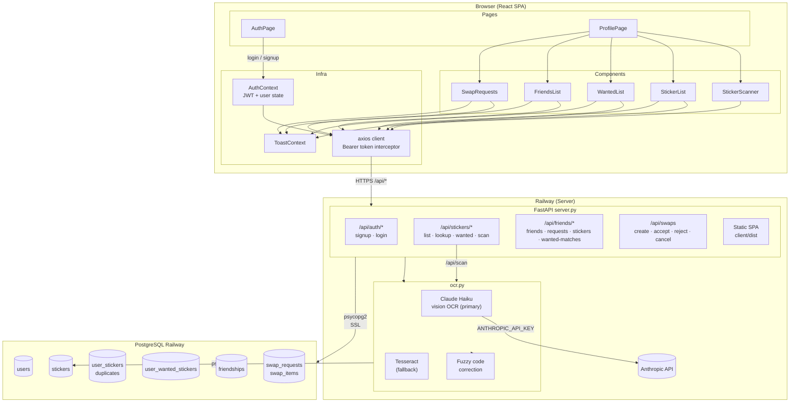
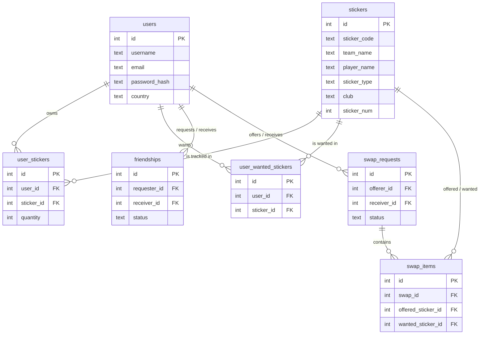
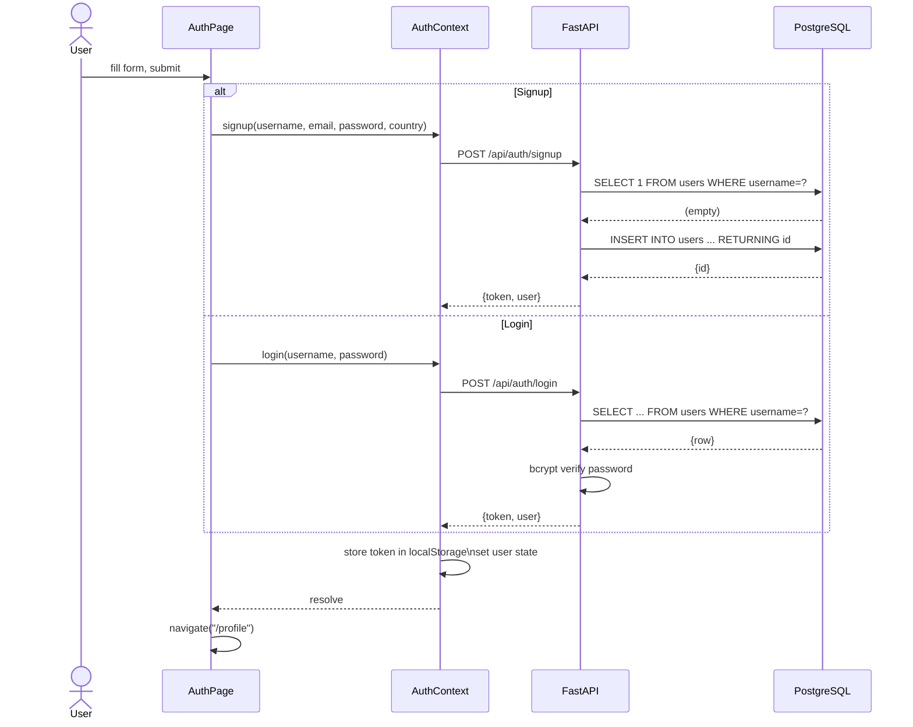
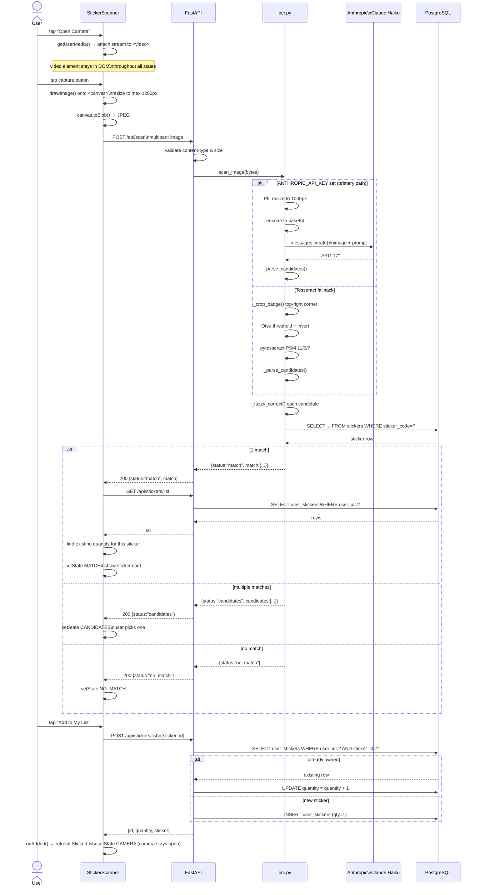
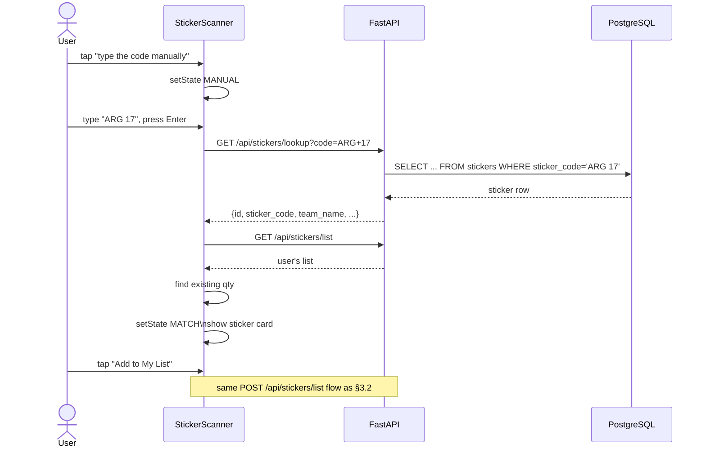
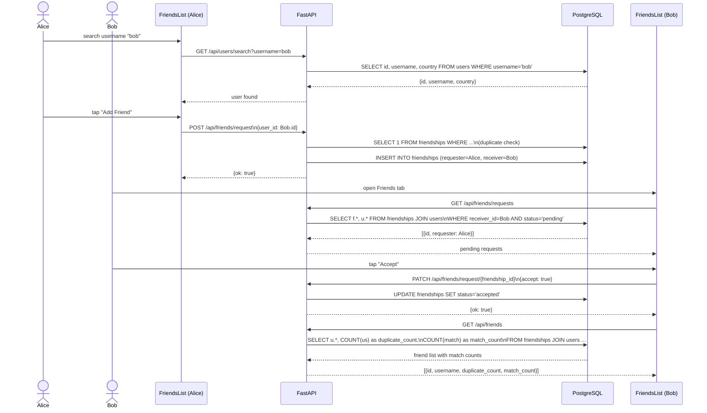
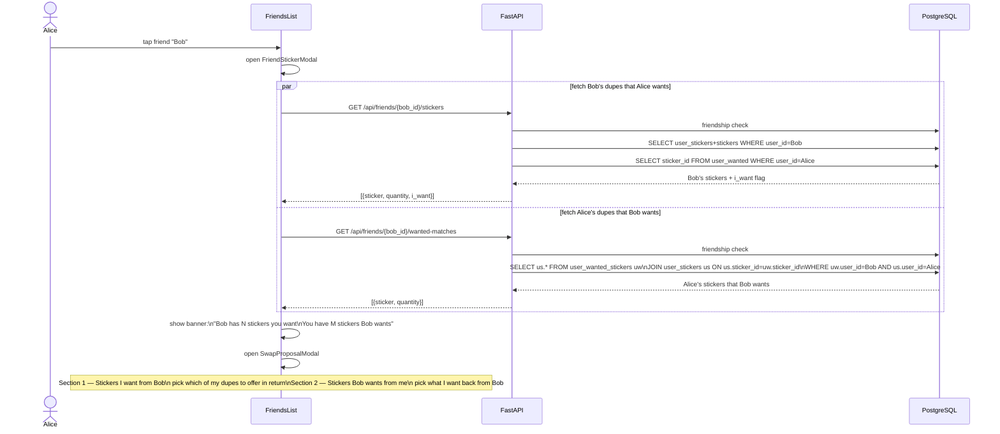
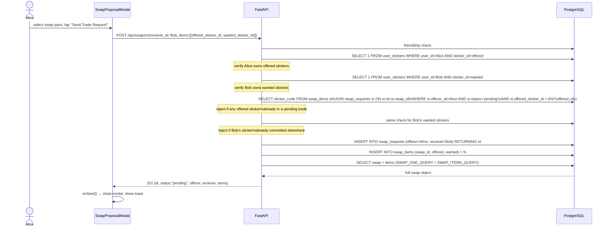
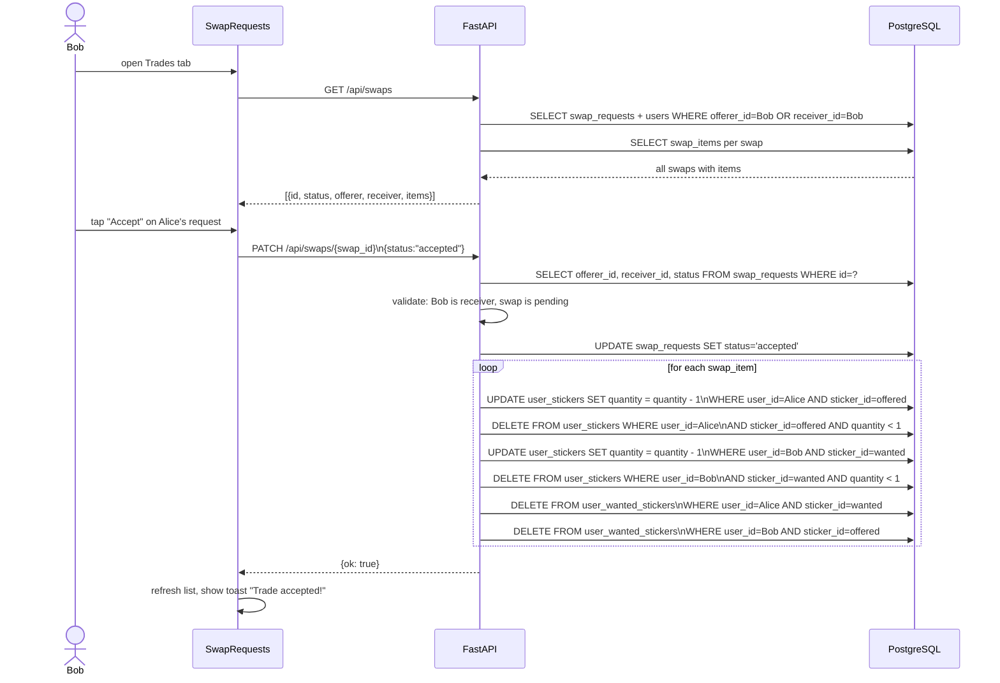
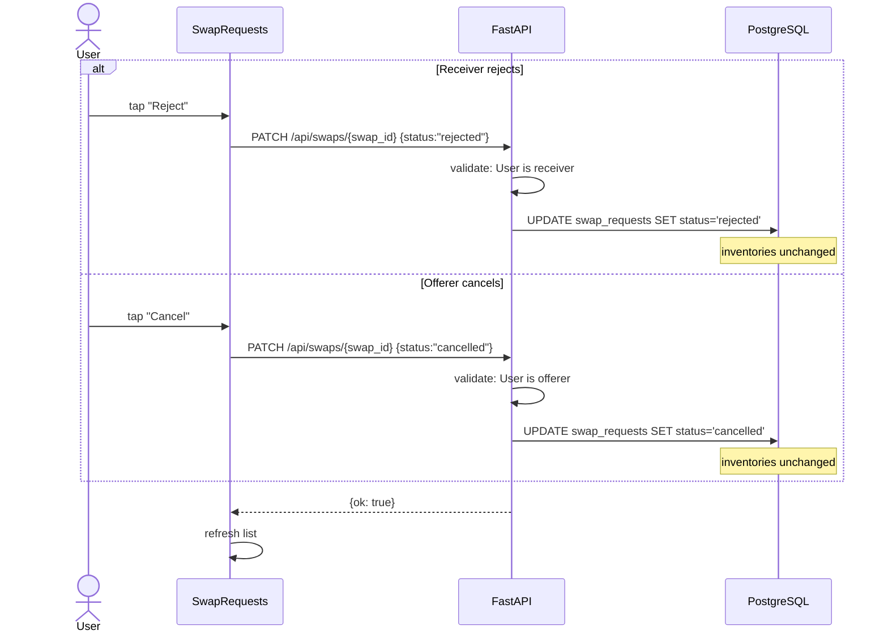

# Sticker Trader — Architecture & Sequence Diagrams

---

## 1. System Architecture

---

## 2. Data Model

---

## 3. Sequence Diagrams

### 3.1 Authentication — Signup & Login

---

### 3.2 Sticker Scan — Camera → OCR → Add to List

---

### 3.3 Manual Sticker Lookup

---

### 3.4 Friend Request Flow

---

### 3.5 Viewing Friend's Stickers & Trade Matches

---

### 3.6 Creating a Trade Request

---

### 3.7 Accepting a Trade Request

---

### 3.8 Rejecting or Cancelling a Trade

